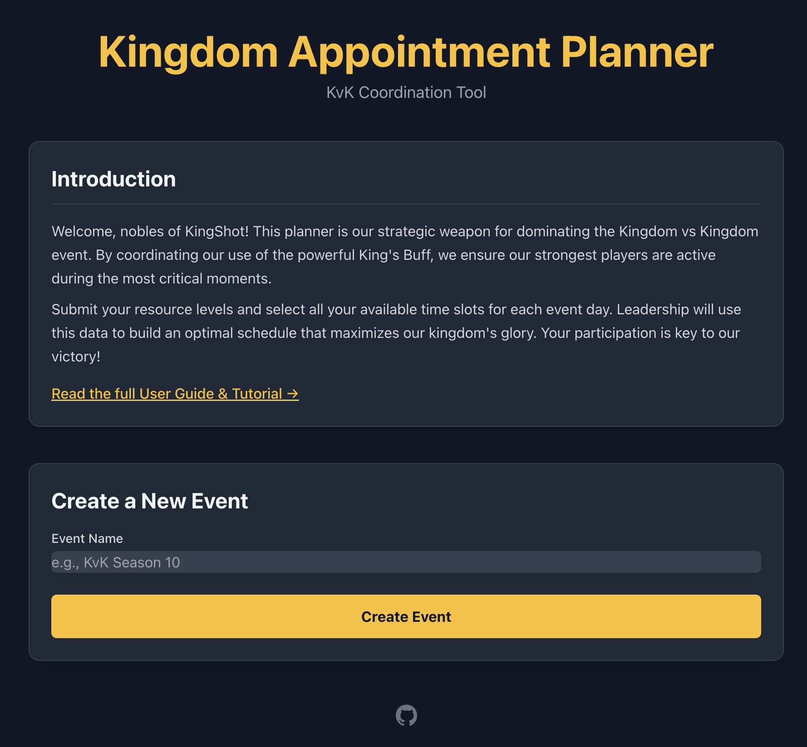
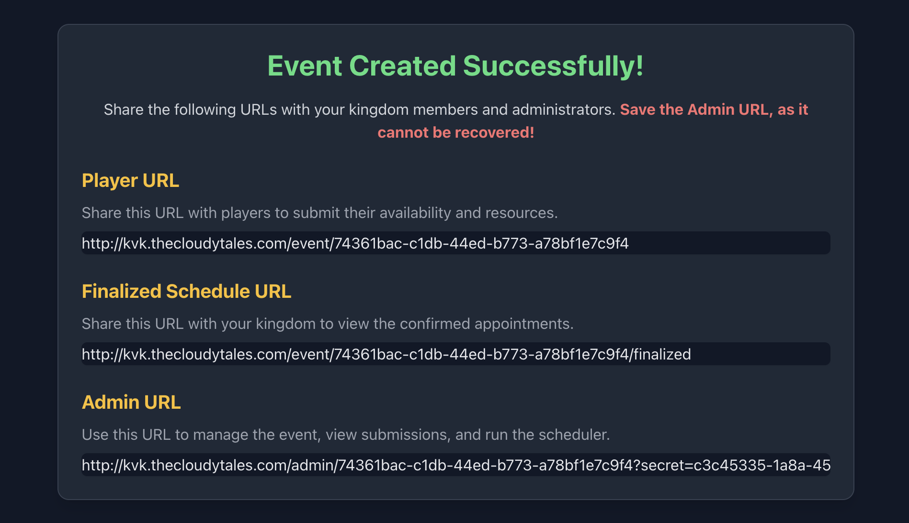
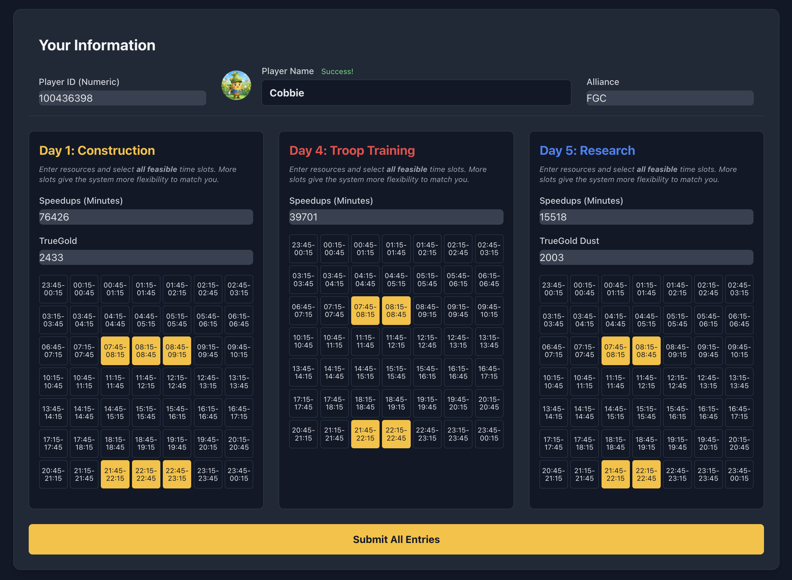
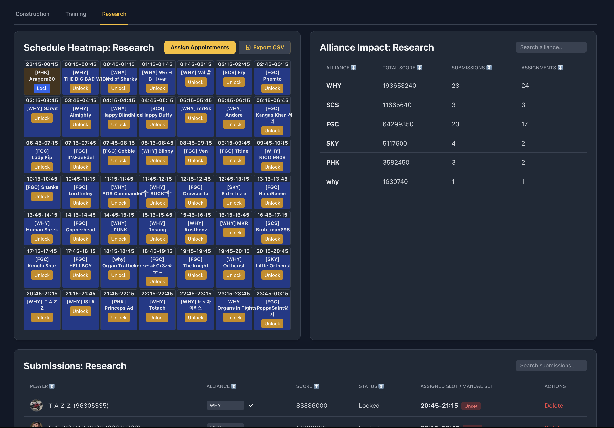
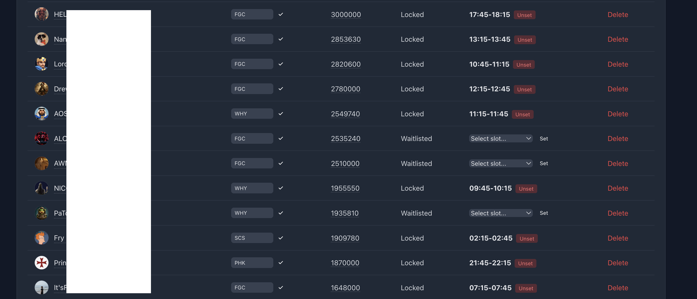
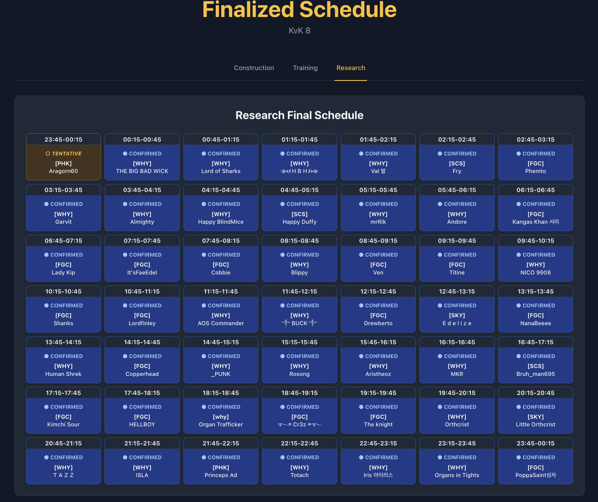

# 👑 Kingdom Appointment Planner

### *Maximize your Kingdom's Glory with Strategic Buff Management*

[](https://opensource.org/licenses/MIT)
[](https://www.python.org/downloads/)
[](https://www.docker.com/)

In the high-stakes world of **Kingdom vs Kingdom (KvK)**, timing isn't just everything—it's the *only* thing. The **Kingdom Appointment Planner** is a specialized strategic tool designed to synchronize your strongest players with the kingdom's "King's Buffs," ensuring every second of that 30-minute window translates into maximum points.



---

## 🎯 Why Use the Planner?

Managing a kingdom of hundreds of players manually is a nightmare. This tool automates the heavy lifting:

*   **Eliminate Spreadsheet Fatigue:** No more manual data entry or juggling conflicting time zones.
*   **Optimal Resource Utilization:** Our "Protected Greedy Algorithm" automatically identifies and assigns players with the highest potential point contribution.
*   **Fair & Transparent:** Clear, publicly accessible schedules ensure everyone knows when it's their time to shine.
*   **Full Admin Control:** Balance automation with manual overrides for high-priority VIPs or special circumstances.

---

## ✨ Key Features

| Feature | Description |
| :--- | :--- |
| **Auto-Fetching** | Players enter their ID; the tool fetches their name and avatar directly from the game! |
| **Smart Scheduling** | Prioritizes players based on Speedups, TrueGold, and availability. |
| **Multi-Day Support** | Independent schedules for Construction (Day 1), Training (Day 4), and Research (Day 2 or 5). |
| **Update Submissions** | Players can re-submit at any time; new entries automatically replace old ones to keep data fresh. |
| **Verification System** | Players can upload backpack screenshots for admins to verify resource claims. |
| **Heatmap Analytics** | Visualize alliance contributions and slot distribution at a glance. |
| **Manual Overrides** | "Lock" automated assignments or manually set specific players to specific slots. |
| **Private Admin Suite** | Secure, tabbed interface for full event management. |

---

## 📸 A Visual Tour

### 1. Simple Event Setup
Create a new KvK event in seconds. You'll receive three unique links: one for players, one for the public, and one (secret!) for you.


### 2. Player-Friendly Submissions
A clean interface where players can submit their resource levels and all feasible time slots across all three major KvK days. **Tip:** If your resource levels change, just submit again—your record will be updated automatically!


### 3. Powerful Admin Dashboard
See a live heatmap of your schedule and a breakdown of alliance impact. The "Assign Appointments" button runs our optimization algorithm in real-time.


### 4. Precision Control
Need to make a quick change? Manually assign players or lock existing appointments to protect them from future auto-shuffles.


### 5. The Finalized Schedule
When you're ready, publish a beautiful, mobile-friendly schedule that the entire kingdom can access.


---

## 🧠 The "Protected Greedy" Algorithm

To ensure the Kingdom generates the absolute maximum points during KvK, the planner uses a specialized optimization strategy:

1.  **Scoring:** Every player is assigned a "Potential Score" based on their available speedups and rare resources (like TrueGold).
2.  **Ranking:** The algorithm sorts all submissions from highest score to lowest.
3.  **Greedy Assignment:** Starting with the highest-ranked player, the system searches for an open slot that matches the player's submitted availability.
4.  **Protection (Locking):** Administrators can "Lock" any appointment. The algorithm treats locked slots as immutable—it will never move a locked player, even if a higher-scoring player becomes available later. This allows leadership to guarantee slots for critical contributors while letting the algorithm handle the rest.

---

## 📖 Administrator's Guide

### Step 1: Launch your Event
Give your event a name (e.g., "KvK Season 12") and select whether your kingdom runs Research on **Day 2** or **Day 5**. Save the **Admin URL**—this is your private key!

### Step 2: Data Collection & Verification
Share the **Player URL** with your kingdom. 

*   **Verification:** Encourage players to upload screenshots of their backpack. You can view these images directly in the Admin Dashboard to verify their resource claims.
*   **Live Updates:** If a player earns more speedups, they can simply use the link again. The system recognizes their Player ID and updates their existing entry.

### Step 3: Optimization
Click **Assign Appointments**. The system will fill the slots, prioritizing players with the most resources. Review the results, make manual tweaks if needed, and "Lock" the slots you are happy with.

### Step 4: Go Live!
Share the **Finalized Schedule URL**. It's read-only and always reflects your latest locked/assigned appointments.

---

## 🚀 Quick Start (Docker)

The application is fully containerized for a one-command deployment.

*   **Clone the Repository:**
```bash
git clone https://github.com/prashmohan/kingdom-appt-planner.git
cd kingdom-appt-planner
```

*   **Launch with Docker Compose:**
```bash
docker-compose up --build -d
```

*   **Access the App:** Open your browser to `http://localhost:12348`.

---

## 💾 Maintenance & Backups

Keep your data safe with our included utility script:

*   **Backup:** `./scripts/db_util.sh backup`
*   **Restore:** `./scripts/db_util.sh restore backups/planner_backup_TIMESTAMP.db`

---

## 🛡️ Security Note

The **Admin URL** contains a unique secret key. Treat it with the same care as your kingdom's treasury—if someone has this link, they have full control over your event.

---

*Built with ❤️ for the KingShot community. Dominate your KvK!* ⚔️
