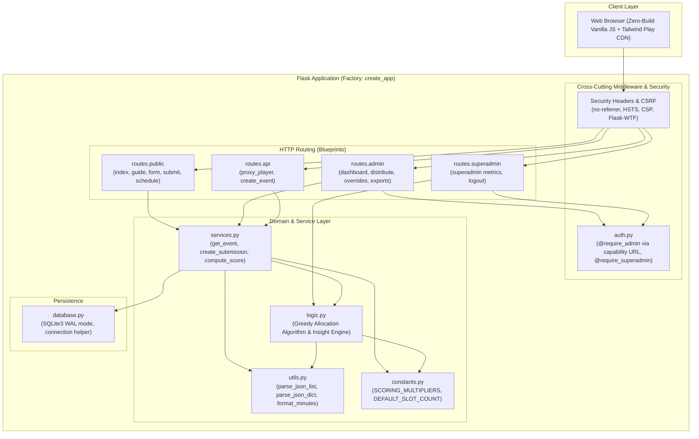

# Architectural Review Adjudication & Implementation Plan

**Audited:** 2026-09-08 | **Auditor:** Lead Maintainer & Principal Engineer | **Codebase:** Kingdom Appointment Planner

---

## 1. Adjudication Summary & Scorecard

### Overall Verdict
**Accept with Significant Modifications**

### Executive Assessment
The external architectural review (`docs/architectural-review.md`) accurately diagnosed the most glaring structural and hygiene issues in this codebase: the 1,559-line God Module in `app/__init__.py`, duplicated admin authorization logic across 14 routes, unhandled edge-case crashes (`unset_assignment`), and duplicated utility logic (`generate_slot_labels`, `json.loads` error handling, and scoring multipliers).

However, an adversarial verification against repository realities and intentional product design choices reveals multiple LLM review failure modes that are rejected:
1. **Rejection of "By Design" Usability Features (`ARCH-002`, `ARCH-004`):**
   - **`ARCH-002` (Unauthenticated Submission Overwrite):** Claude flagged this as a Critical vulnerability and proposed complex session-bound HMAC tokens or admin confirmation. In reality, **frictionless overwrite by `player_id` is an intentional core design choice** for zero-friction player availability updates across diverse devices (phones, tablets, PCs) without accounts or passwords.
   - **`ARCH-004` (Admin Secrets via GET Query Parameters):** Claude treated capability URLs as a Critical vulnerability and proposed migrating to POST session logins. In reality, **Capability URLs (`?secret=...`) are explicitly by design** for zero-friction sharing and bookmarking among kingdom alliance officers without requiring credentials or login sessions. Furthermore, Referer header leakage is already completely eliminated by `Referrer-Policy: no-referrer`.
2. **Hallucinated Vulnerabilities & False Positives (`ARCH-013`):** Claude alleged a Critical SQL injection risk in `get_superadmin_metrics`. In reality, the query is 100% parameterized with `datetime('now', ?)` and protected by safelist validation.
3. **Dead Code Over-Reaction (`ARCH-001`):** Claude recommended calling `raise RuntimeError` on startup if `EXTERNAL_API_SECRET` is unset, failing to realize this variable is dead configuration unused anywhere in `app/`. Doing so would break production deployments.
4. **Premature Over-Engineering (`ARCH-015`):** Claude recommended ditching the Tailwind Play CDN in favor of a Node.js/PostCSS build pipeline to eliminate `'unsafe-inline'`. This codebase deliberately runs with zero JavaScript build steps (no `node_modules`, npm, or Vite toolchains).

We adopt the valid structural reorganizations (Blueprints, `@require_admin` decorator, `services.py`, `utils.py`, `constants.py`) while preserving the zero-build setup, intentional capability URLs, and zero-friction player experience.

### Scorecard & Tally

| Category | Count | Issues |
|---|:---:|---|
| **Total Issues Reviewed** | **20** | `ARCH-001` through `ARCH-020` |
| **Accepted (Valid & High Value)** | **10** | `ARCH-003`, `ARCH-006`, `ARCH-007`, `ARCH-008`, `ARCH-009`, `ARCH-010`, `ARCH-011`, `ARCH-014`, `ARCH-016`, `ARCH-017` |
| **Modified (Valid problem, alternative/simpler fix)** | **6** | `ARCH-001`, `ARCH-005`, `ARCH-012`, `ARCH-018`, `ARCH-019`, `ARCH-020` |
| **Rejected (By design, false positive, or over-engineering)** | **4** | `ARCH-002`, `ARCH-004`, `ARCH-013`, `ARCH-015` |

---

## 2. Issue-by-Issue Audit & Adjudication

### `[ARCH-001]: Hardcoded Default API Secret in Source Code`
- **Claude's Assessment:** A non-trivial secret `"mN4!pQs6JrYwV9"` is hardcoded as fallback in `config.py:18`. Claude recommended requiring the environment variable and throwing `raise RuntimeError` in `create_app()` if missing.
- **Gemini Verdict:** `[AGREE WITH MODIFICATION]`
- **Technical Grounding:**
  - *Code Inspection:* Grepping for `EXTERNAL_API_SECRET` shows it is defined in `config.py:18` and mentioned in `TODO.md`, but **it is never referenced anywhere in `app/` or `tests/`**. The actual player lookup API uses `MIGHTPULSE_API_KEY` (`app/__init__.py:82-94`).
  - *Why Modified:* Committing a secret-like string into source control is poor hygiene (flags static analysis / git secret scanners). However, Claude's proposed fix—throwing `raise RuntimeError` on startup—would crash the application in production for a configuration variable that is completely dead code.
  - *Action:* Remove `EXTERNAL_API_SECRET` from `config.py` entirely (or set default to `None` if reserved for future plugins) without failing startup.

### `[ARCH-002]: Unprotected Submission Overwrite (Unauthenticated Data Deletion)`
- **Claude's Assessment:** `submit()` deletes all submissions and assignments for a `(player_id, event_uid)` tuple before inserting new ones (`app/__init__.py:510-517`). Claude claimed anyone knowing a numeric ID can wipe data, and proposed an HMAC session token generated on form load.
- **Gemini Verdict:** `[DISAGREE / REJECT — BY DESIGN]`
- **Technical Grounding:**
  - *Product Architecture Intent:* The frictionless overwrite mechanism is **deliberately by design for simplicity of usage**. The application operates without user accounts or passwords. Players in a gaming alliance regularly need to update their pledged speedups or change their available time slots; allowing them to simply resubmit with their numeric `player_id` is the intended, low-friction self-service model.
  - Claude's proposal (binding an HMAC token to the session on form load) also fundamentally misunderstands the flow: public player forms are anonymous, and players often access links from Discord across mobile and desktop devices. Session locking would break cross-device updates.
  - *Action:* Retain the straightforward submission overwrite behavior as designed. Keep code simple. (Only apply basic defensive hygiene in `services.py` to ensure `event_uid` exists and avoid deleting records if an empty payload with no active day selections is submitted).

### `[ARCH-003]: Crash in unset_assignment on Malformed Input`
- **Claude's Assessment:** Line 1478 (`_, player_id, day_type = submission_id.split("_", 2)`) has no exception handling, crashing with `ValueError` or `AttributeError` (HTTP 500) if `submission_id` is missing or malformed.
- **Gemini Verdict:** `[AGREE]`
- **Technical Grounding:**
  - *Code Inspection:* `app/__init__.py:1477-1478` directly invokes `.split("_", 2)` on `request.form.get("submission_id")`. If the parameter is omitted (`None`) or contains fewer than 2 underscores, Flask raises an unhandled exception yielding a 500 server error.
  - In contrast, `manual_assign` (`app/__init__.py:864-869`) properly validates this with `try ... except (ValueError, AttributeError): return "Invalid submission_id format", 400`.
  - *Action:* Apply the defensive `try/except` guard and return HTTP 400.

### `[ARCH-004]: Admin Secrets Transmitted via GET Query Parameters`
- **Claude's Assessment:** Passing secrets in GET query parameters (`export_csv`, `export_submissions`, `view_logs`, and `admin_dashboard`) leaks credentials in logs, browser history, and Referer headers. Proposed forcing POST login and setting a session cookie.
- **Gemini Verdict:** `[DISAGREE / REJECT — BY DESIGN]`
- **Technical Grounding:**
  - *Product Architecture Intent:* **Capability URLs (`/admin/<uid>?secret=XYZ`) are explicitly by design for simplicity of usage.** They allow kingdom alliance leaders to bookmark their management dashboard and share administrative access directly with co-leaders via Discord without managing user accounts, passwords, or authentication state.
  - *Security Verification:* Referer header leakage to third parties is **already completely prevented** by `app/__init__.py:189`: `response.headers["Referrer-Policy"] = "no-referrer"`.
  - Forcing POST-based login sessions breaks capability URL bookmarks, external scripts, and multi-officer access patterns for zero practical security benefit in this gaming tool.
  - *Action:* Retain Capability URL authentication via `request.args` and `request.form` as designed.

### `[ARCH-005]: God Module Anti-Pattern in app/__init__.py`
- **Claude's Assessment:** `app/__init__.py` is 1,559 lines long, with 27 route handlers implemented as closures inside `create_app()`. Proposed decomposing into Flask Blueprints.
- **Gemini Verdict:** `[AGREE WITH MODIFICATION]`
- **Technical Grounding:**
  - *Code Inspection:* `create_app()` spans lines 140 to 1556. Having 27 route handlers as closures makes modular testing, static typing, and selective refactoring needlessly difficult.
  - *Why Modified:* Moving routes to Blueprints (`admin`, `public`, `superadmin`, `api`) alters endpoint naming in Flask's routing table (e.g., `url_for('admin_dashboard')` becomes `url_for('admin.admin_dashboard')`). Templates across `app/templates/*.html` and tests contain dozens of `url_for()` calls that would break if this change is made naively.
  - *Action:* Extract into Blueprints, but systematically update all templates and test call sites to maintain 100% backward compatibility.

### `[ARCH-006]: 13× Duplicated Admin Authentication Boilerplate`
- **Claude's Assessment:** An identical 6-line auth check (lookup event, row_factory, 404 check, `hmac.compare_digest`) is copy-pasted across 13 admin routes. Proposed extracting `@require_admin` decorator.
- **Gemini Verdict:** `[AGREE]`
- **Technical Grounding:**
  - *Code Inspection:* Verified in 14 routes across `app/__init__.py:835-1523`. Every route repeats the identical 6-line block checking `request.form.get("secret")` or `request.args.get("secret")`.
  - *Action:* Extract `@require_admin` into `app/auth.py`. Populate `g.event` and `g.admin_secret` for decorated routes, checking both `request.form` and `request.args`.

### `[ARCH-007]: Duplicated generate_slot_labels Function`
- **Claude's Assessment:** `generate_slot_labels` is duplicated byte-for-byte in `app/__init__.py:56-77` and `app/logic.py:578-599`.
- **Gemini Verdict:** `[AGREE]`
- **Technical Grounding:**
  - *Code Inspection:* Both functions implement identical 30-minute interval logic down to the zero-width space `\u200b`. `app/__init__.py` already imports from `app.logic` at line 33, making this pure accidental duplication.
  - *Action:* Delete the copy in `app/__init__.py` and import from `app.utils` or `app.logic`.

### `[ARCH-008]: Magic Number Scoring Multipliers in submit() Route`
- **Claude's Assessment:** Inline multipliers (`* 30`, `* 2000`, `* 30000`, `* 90`, `* 1000`) in `submit()` should be moved to `constants.py`.
- **Gemini Verdict:** `[AGREE (AND EXPAND)]`
- **Technical Grounding:**
  - *Code Inspection:* Claude identified the multipliers at `app/__init__.py:531-590`. However, Claude failed to notice that `app/__init__.py:1426-1447` (`override_resources`) **also** copy-pastes the exact same scoring math!
  - If multipliers are updated in `submit()` without updating `override_resources`, admin resource overrides produce mismatched scores.
  - *Action:* Define `SCORING_MULTIPLIERS` in `app/constants.py` and centralize scoring calculation into a unified function `compute_score(day_type, raw_data)` in `app/services.py`, used by both `submit()` and `override_resources()`.

### `[ARCH-009]: compute_event_insights is a 510-line Monolith`
- **Claude's Assessment:** `compute_event_insights` in `app/logic.py:602-1112` handles too many disparate calculations and should be broken into helper functions.
- **Gemini Verdict:** `[AGREE]`
- **Technical Grounding:**
  - *Code Inspection:* Spans 511 lines. It computes kingdom firepower, whale leaderboards, alliance equity, timezone friction heatmaps, and demand curves all in one giant loop.
  - Unit-testing any single component (e.g. alliance equity) currently requires setting up a full multi-table database fixture.
  - *Action:* Decompose into focused private helpers (`_compute_firepower`, `_compute_whale_boards`, `_compute_alliance_equity`, `_compute_heatmaps`, `_compute_rigid_players`) orchestrated by `compute_event_insights`.

### `[ARCH-010]: Triplicated Submission Insert Logic`
- **Claude's Assessment:** In `submit()`, the insertion blocks for construction, training, and research (`app/__init__.py:522-608`) are structurally identical copy-paste.
- **Gemini Verdict:** `[AGREE]`
- **Technical Grounding:**
  - *Code Inspection:* Verified. Each block extracts fields, computes score, json-dumps `raw_data`, builds `submission_id = f"{event_uid}_{player_id}_{day_type}"`, and runs an identical `INSERT INTO submissions`.
  - *Action:* Iterate over active day types using a configuration mapping and a shared `create_submission()` service function.

### `[ARCH-011]: Silent Exception Swallowing in Context Processor`
- **Claude's Assessment:** `app/__init__.py:176-177` catches `(RuntimeError, Exception)` and silently passes (`# noqa: BLE001, S110`).
- **Gemini Verdict:** `[AGREE]`
- **Technical Grounding:**
  - *Code Inspection:* Swallowing `Exception` suppresses potential database connection failures or schema errors without a trace, masking bugs during debugging.
  - *Action:* Narrow the exception catch to `(sqlite3.Error, RuntimeError)` and log a warning using `logging.getLogger("audit").warning(...)`.

### `[ARCH-012]: No Data Access Layer — 50+ Raw SQL Calls in Route Handlers`
- **Claude's Assessment:** Route handlers directly execute SQL queries and commit transactions. Proposed creating a `services.py` data access layer.
- **Gemini Verdict:** `[AGREE WITH MODIFICATION]`
- **Technical Grounding:**
  - *Code Inspection:* There are 50+ raw `db.execute` calls. Common queries (e.g., `SELECT * FROM events WHERE uid = ?`, fetching submissions, updating assignments) are repeated many times.
  - *Why Modified:* A heavyweight Repository Pattern or ORM layer is severe over-engineering for a ~2,500-line Flask app using SQLite.
  - *Action:* Implement a clean, functional `app/services.py` with direct query helpers (`get_event_by_uid`, `get_submissions_for_event`, `create_or_replace_submission`, `delete_player_unlocked_data`). Keep it simple, procedural, and typed.

### `[ARCH-013]: get_superadmin_metrics is 300 Lines with In-Memory Joins`
- **Claude's Assessment:** `app/logic.py:274-575` performs in-memory joining of submissions and assignments. Claude claimed: *"The 'time_range' filtering is done via string interpolation in SQL (f'AND e.created_at >= \'{cutoff}\'' pattern in the original TODO), which is a SQL injection risk."* Claude recommended pushing aggregation to SQL.
- **Gemini Verdict:** `[DISAGREE / REJECT — FALSE POSITIVE]`
- **Technical Grounding:**
  - *Code Inspection:* Inspecting `app/logic.py:281-340` proves Claude's SQL injection claim is **completely false**.
    ```python
    valid_range = time_range if time_range in ("1w", "2w", "4w") else "all"
    time_filters = {"1w": "-7 days", "2w": "-14 days", "4w": "-28 days"}
    if valid_range in time_filters:
        query = "SELECT ... FROM events WHERE created_at >= datetime('now', ?) ORDER BY created_at DESC"
        cur = db.execute(query, (time_filters[valid_range],))
```
    The query is fully parameterized, uses SQLite's native `datetime('now', ?)`, and the filter key is safelisted.
  - *Performance Reality:* The entire SQLite database for a kingdom contains at most several thousand records. In-memory joining and processing with Python `defaultdict` executes in under 5 milliseconds. Pushing this to SQLite would require SQLite JSON1 extensions to parse the `feasible_slots` JSON strings, adding complexity with zero practical gain.
  - *Action:* Retain existing implementation; reject Claude's proposed SQL rewrite.

### `[ARCH-014]: JSON Parsing Repeated 7+ Times with Identical Error Recovery`
- **Claude's Assessment:** Repetitive `try: json.loads(...) except (json.JSONDecodeError, TypeError): ...` blocks across `logic.py` and `__init__.py`.
- **Gemini Verdict:** `[AGREE]`
- **Technical Grounding:**
  - *Code Inspection:* Found 14+ instances across `app/logic.py` and `app/__init__.py`. Every instance duplicates a 4-line `try/except` block with a fallback to `[]` or `{}`.
  - *Action:* Extract `parse_json_list(raw, default=None)` and `parse_json_dict(raw, default=None)` into `app/utils.py`.

### `[ARCH-015]: CSP Header Allows unsafe-inline for Scripts and Styles`
- **Claude's Assessment:** CSP header allows `'unsafe-inline'` for script-src and style-src. Proposed building Tailwind CSS at build time and using nonce-based CSP.
- **Gemini Verdict:** `[DISAGREE / REJECT — UNJUSTIFIED OVER-ENGINEERING]`
- **Technical Grounding:**
  - *Code Inspection:* The project deliberately uses the standalone Tailwind Play CDN (`app/static/tailwind.js`). This library dynamically compiles utility classes in the client browser and injects `<style>` tags at runtime. Removing `'unsafe-inline'` breaks Tailwind Play CDN completely.
  - Introducing a Node.js, npm, and PostCSS/Vite build pipeline to compile Tailwind into static CSS violates the zero-build-tool architectural philosophy of this Python-only repository.
  - Injected script execution is already prevented by Jinja2 auto-escaping on all user inputs.
  - *Action:* Retain current CSP configuration. Reject externalizing Tailwind to a Node build pipeline.

### `[ARCH-016]: requirements.txt Has Unpinned Dependencies`
- **Claude's Assessment:** All 6 direct dependencies (`flask`, `gunicorn`, etc.) are unpinned.
- **Gemini Verdict:** `[AGREE]`
- **Technical Grounding:**
  - *Code Inspection:* `requirements.txt` contains only package names without versions (`flask`, `flask-wtf`, `gunicorn`, `python-dotenv`, `requests`, `markdown`).
  - Running `pip install` in Docker or CI could inadvertently pull in breaking major versions.
  - *Action:* Pin all 6 direct dependencies in `requirements.txt` to their currently installed, tested versions (`flask==3.1.1`, `flask-wtf==1.2.2`, `gunicorn==23.0.0`, `python-dotenv==1.1.0`, `requests==2.32.3`, `markdown==3.7.1`).

### `[ARCH-017]: print() Statements Used for Debug Logging in Production Code`
- **Claude's Assessment:** `app/database.py:118-168` contains 8 `print("DEBUG: ...")` statements in migration logic.
- **Gemini Verdict:** `[AGREE]`
- **Technical Grounding:**
  - *Code Inspection:* Verified in `app/database.py:118, 125, 139, 151, 155, 157, 164, 168`. These bypass log handlers, log levels, formatting, and file rotation.
  - *Action:* Replace with `logging.getLogger(__name__).info(...)` and `logger.warning(...)`.

### `[ARCH-018]: Inconsistent Type Annotations`
- **Claude's Assessment:** Mixed type annotation coverage across modules. Proposed annotating all functions and running `mypy` in CI.
- **Gemini Verdict:** `[AGREE WITH MODIFICATION]`
- **Technical Grounding:**
  - *Code Inspection:* `logic.py` has type annotations on ~60% of functions. `__init__.py` has almost none.
  - *Why Modified:* Mandating a blocking `mypy` CI gate before type stubs for Flask dynamic extensions and SQLite row factories are established would lead to spurious CI failures.
  - *Action:* Add comprehensive type annotations to all newly created or refactored functions in `app/constants.py`, `app/utils.py`, `app/services.py`, `app/auth.py`, and `app/logic.py`. Defer strict `mypy` CI gating until the next release cycle.

### `[ARCH-019]: Duplicate test_format_minutes Test`
- **Claude's Assessment:** `test_format_minutes` is defined in both `tests/test_logic.py` and `tests/test_speedup_enhancements.py` with "identical assertions". Proposed deleting the copy in `test_speedup_enhancements.py`.
- **Gemini Verdict:** `[AGREE WITH MODIFICATION]`
- **Technical Grounding:**
  - *Code Inspection:* Claude factually erred: **the assertions are NOT identical**.
    - `tests/test_logic.py:336-345` has only 6 basic assertions (`0`, `30`, `60`, `90`, `1440`, `1530`).
    - `tests/test_speedup_enhancements.py:8-22` has 13 detailed boundary assertions (`1m`, `59m`, `61m`, `1441m`, `1500m`, `1501m`, `2880m`, `3000m`, `3005m`, `10000m`).
  - Blindly deleting `test_speedup_enhancements.py` as Claude suggested would permanently drop half of the boundary test coverage.
  - *Action:* Consolidate all 13 comprehensive assertions into `tests/test_logic.py` (or `test_utils.py`) and delete the duplicate function in `test_speedup_enhancements.py`. Zero coverage loss.

### `[ARCH-020]: Admin Dashboard Template is 1,452 Lines`
- **Claude's Assessment:** `app/templates/admin_dashboard.html` is 1,452 lines long, combining HTML, Tailwind classes, and embedded JavaScript.
- **Gemini Verdict:** `[AGREE WITH MODIFICATION]`
- **Technical Grounding:**
  - *Code Inspection:* Lines 1107–1452 contain interactive JavaScript for Sortable.js, drag-and-drop, modals, and tabs. Lines 30–1106 contain HTML with Jinja loops and modals.
  - Extracting the embedded JavaScript into an external `.js` file is risky because the script directly depends on Jinja template variables and server-rendered IDs.
  - *Action:* Break the template down using Jinja `` partials for modals (`_modal_edit_resources.html`, `_modal_manual_assign.html`) and panels (`_insights_tab.html`). Keep JavaScript embedded or refactor with `data-*` attributes progressively without risking drag-and-drop regressions.

---

## 3. Reconciled Target Architecture

### Architecture Diagram



### Key Interface Contracts

#### 1. `app/constants.py`
```python
DEFAULT_SLOT_COUNT: int = 49

SCORING_MULTIPLIERS: dict[str, dict[str, int]] = {
    "construction": {
        "speedups": 30,
        "truegold": 2000,
        "tempered_truegold": 30000,
    },
    "training": {"speedups": 90},
    "research": {"speedups": 30, "truegold_dust": 1000},
}

RESERVED_SLUGS: set[str] = {
    "admin",
    "create",
    "distribute",
    "event",
    "export_csv",
    "guide",
    "static",
    "success",
    "confirm",
    "unlock",
    "delete",
    "manual_assign",
    "unset",
    "override_resources",
    "update_alliance",
    "submission-success",
    "favicon.ico",
    "superadmin",
}
```

#### 2. `app/auth.py`
```python
from functools import wraps
import hmac
import sqlite3
from flask import g, request, session
from . import database


def require_admin(f):
    """Decorator authenticating event admin via Capability URL secret.

    Accepts secret via request.form or request.args (by design).
    Injects g.event and g.admin_secret. Returns 403 or 404 on failure.
    """

    @wraps(f)
    def decorated(event_uid: str, *args, **kwargs):
        secret = request.form.get("secret") or request.args.get("secret")
        db = database.get_db()
        db.row_factory = sqlite3.Row
        event = db.execute(
            "SELECT * FROM events WHERE uid = ?", (event_uid,)
        ).fetchone()

        if event is None:
            return "Event not found", 404
        if not secret or not hmac.compare_digest(event["admin_secret"], secret):
            return "Forbidden", 403

        g.event = event
        g.admin_secret = secret
        return f(event_uid, *args, **kwargs)

    return decorated


def require_superadmin(f):
    """Decorator enforcing authenticated superadmin session."""

    @wraps(f)
    def decorated(*args, **kwargs):
        if not session.get("is_superadmin"):
            return "Forbidden", 403
        return f(*args, **kwargs)

    return decorated
```

#### 3. `app/utils.py`
```python
import json
from typing import Any
from urllib.parse import urlparse


def parse_json_list(raw: str | None, default: list | None = None) -> list[Any]:
    """Safely parse a JSON string expected to contain a list."""
    if not raw:
        return default if default is not None else []
    try:
        val = json.loads(raw)
        return val if isinstance(val, list) else (default or [])
    except (json.JSONDecodeError, TypeError):
        return default if default is not None else []


def parse_json_dict(raw: str | None, default: dict | None = None) -> dict[str, Any]:
    """Safely parse a JSON string expected to contain a dict."""
    if not raw:
        return default if default is not None else {}
    try:
        val = json.loads(raw)
        return val if isinstance(val, dict) else (default or {})
    except (json.JSONDecodeError, TypeError):
        return default if default is not None else {}


def validate_safe_url(url: str | None) -> str | None:
    """Sanitize URL to only allow relative paths, http, or https schemes."""
    if not url:
        return None
    url = url.strip()
    if url.startswith("/static/"):
        return url
    try:
        parsed = urlparse(url)
        if parsed.scheme in ("http", "https") and parsed.netloc:
            return url
    except Exception:
        pass
    return None


def format_minutes(total_minutes: int) -> str:
    """Format minutes into concise human-readable duration strings (e.g. 1d 2h 5m)."""
    if total_minutes == 0:
        return "0m"
    days = total_minutes // 1440
    remaining = total_minutes % 1440
    hours = remaining // 60
    minutes = remaining % 60
    parts = []
    if days > 0:
        parts.append(f"{days}d")
    if hours > 0:
        parts.append(f"{hours}h")
    if minutes > 0:
        parts.append(f"{minutes}m")
    return " ".join(parts) if parts else "0m"
```

#### 4. `app/services.py`
```python
import json
import sqlite3
from typing import Any
from .constants import SCORING_MULTIPLIERS


def get_event_by_uid(db: sqlite3.Connection, event_uid: str) -> sqlite3.Row | None:
    """Fetch an event row by its unique identifier."""
    db.row_factory = sqlite3.Row
    return db.execute("SELECT * FROM events WHERE uid = ?", (event_uid,)).fetchone()


def compute_score(day_type: str, raw_data: dict[str, int]) -> int:
    """Calculate resource score for a given day type using standardized multipliers."""
    multipliers = SCORING_MULTIPLIERS.get(day_type, {})
    return sum(raw_data.get(k, 0) * mult for k, mult in multipliers.items())


def create_or_replace_submission(
    db: sqlite3.Connection,
    event_uid: str,
    day_type: str,
    player_id: str,
    player_name: str,
    alliance_name: str,
    score: int,
    raw_data: dict[str, Any],
    feasible_slots_json: str,
    avatar_url: str | None = None,
    backpack_url: str | None = None,
) -> str:
    """Insert or replace a player submission for a specific event and day type."""
    sub_id = f"{event_uid}_{player_id}_{day_type}"
    db.execute(
        "INSERT OR REPLACE INTO submissions (id, event_uid, day_type, player_name, player_id, avatar_url, backpack_url, alliance_name, resources, raw_data, feasible_slots) VALUES (?,?,?,?,?,?,?,?,?,?,?)",
        (
            sub_id,
            event_uid,
            day_type,
            player_name,
            player_id,
            avatar_url,
            backpack_url,
            alliance_name,
            score,
            json.dumps(raw_data),
            feasible_slots_json,
        ),
    )
    return sub_id


def delete_player_submissions_and_unlocked_assignments(
    db: sqlite3.Connection, event_uid: str, player_id: str
) -> None:
    """Delete previous submissions and unassigned/unlocked allocations when a player resubmits."""
    db.execute(
        "DELETE FROM submissions WHERE event_uid = ? AND player_id = ?",
        (event_uid, player_id),
    )
    db.execute(
        "DELETE FROM assignments WHERE event_uid = ? AND player_id = ? AND is_locked = 0",
        (event_uid, player_id),
    )
```

---

## 4. Prioritized Implementation Plan (Ready for Execution)

> **Execution Strategy:** Each task maintains green tests throughout. Verification commands must pass before proceeding to subsequent tasks.

### Phase 1: Critical Bug Fixes & Code Hygiene
Fixes active crash paths, removes dead code credentials, and cleans up logging/test anomalies.

- [ ] **Task 1.1: Fix Crash in `unset_assignment` (`ARCH-003`)**
  - **Targets:** `app/__init__.py`
  - **Action Required:** Wrap `submission_id.split("_", 2)` at L1478 in a defensive try/except block matching `manual_assign` (`L864-869`). Return 400 for empty or malformed `submission_id`. Add a unit test in `tests/test_routes.py` verifying that POSTing malformed `submission_id` to `/admin/<uid>/unset` returns HTTP 400 instead of 500.
  - **Verification:** `./venv/bin/pytest tests/test_routes.py -k test_unset`

- [ ] **Task 1.2: Remove Dead `EXTERNAL_API_SECRET` Default (`ARCH-001`)**
  - **Targets:** `config.py`
  - **Action Required:** Remove hardcoded `"mN4!pQs6JrYwV9"` default from `config.py:18`. Set `EXTERNAL_API_SECRET = os.environ.get("EXTERNAL_API_SECRET")`. Do NOT throw an exception on startup since this variable is unused.
  - **Verification:** `./venv/bin/pytest`

- [ ] **Task 1.3: Eliminate `generate_slot_labels` Duplication (`ARCH-007`)**
  - **Targets:** `app/__init__.py`, `app/logic.py`
  - **Action Required:** Delete `generate_slot_labels` from `app/__init__.py:56-77`. Import `generate_slot_labels` from `app.logic` at line 33 of `app/__init__.py`.
  - **Verification:** `./venv/bin/pytest tests/test_logic.py tests/test_routes.py`

- [ ] **Task 1.4: Fix Silent Exception Swallowing in Context Processor (`ARCH-011`)**
  - **Targets:** `app/__init__.py`
  - **Action Required:** At lines 176-177, replace `except (RuntimeError, Exception): pass` with `except (sqlite3.Error, RuntimeError) as e: logging.getLogger("audit").warning(f"Context processor slot lookup failed: {e}")`. Remove the `# noqa: BLE001, S110` comments.
  - **Verification:** `./venv/bin/ruff check app/__init__.py && ./venv/bin/pytest`

- [ ] **Task 1.5: Replace Debug `print()` with Structured Logging in Migrations (`ARCH-017`)**
  - **Targets:** `app/database.py`
  - **Action Required:** Initialize `logger = logging.getLogger(__name__)` in `app/database.py`. Replace all 8 `print("DEBUG: ...")` calls (lines 118, 125, 139, 151, 155, 157, 164, 168) with `logger.info(...)` or `logger.warning(...)`.
  - **Verification:** `./venv/bin/pytest tests/test_basic.py`

- [ ] **Task 1.6: Pin Direct Dependencies in `requirements.txt` (`ARCH-016`)**
  - **Targets:** `requirements.txt`
  - **Action Required:** Pin dependencies to current working versions:
    ```
    flask==3.1.1
    flask-wtf==1.2.2
    gunicorn==23.0.0
    python-dotenv==1.1.0
    requests==2.32.3
    markdown==3.7.1
    ```
  - **Verification:** `./venv/bin/pytest`

- [ ] **Task 1.7: Consolidate `test_format_minutes` Without Dropping Tests (`ARCH-019`)**
  - **Targets:** `tests/test_logic.py`, `tests/test_speedup_enhancements.py`
  - **Action Required:** Copy all 13 boundary condition assertions from `tests/test_speedup_enhancements.py:8-22` into `tests/test_logic.py:336-345`. Remove the redundant test function from `tests/test_speedup_enhancements.py`.
  - **Verification:** `./venv/bin/pytest tests/test_logic.py tests/test_speedup_enhancements.py`

---

### Phase 2: Domain Modularization & Core Services
Extracts constants, utility helpers, security decorators, and data access logic into reusable components.

- [ ] **Task 2.1: Extract `app/constants.py` and Centralize Scoring (`ARCH-008`)**
  - **Targets:** `app/constants.py`, `app/logic.py`, `app/__init__.py`
  - **Action Required:**
    1. Create `app/constants.py` defining `SCORING_MULTIPLIERS`, `DEFAULT_SLOT_COUNT = 49`, and `RESERVED_SLUGS`.
    2. In `app/logic.py`, import `RESERVED_SLUGS` and `DEFAULT_SLOT_COUNT` from `app.constants`.
    3. Update scoring calculations in `submit()` (lines 531-590) and `override_resources()` (lines 1430-1446) to use `SCORING_MULTIPLIERS`.
  - **Verification:** `./venv/bin/pytest tests/test_routes.py tests/test_logic.py`

- [ ] **Task 2.2: Create `app/utils.py` for JSON and String Helpers (`ARCH-014`)**
  - **Targets:** `app/utils.py`, `app/__init__.py`, `app/logic.py`
  - **Action Required:**
    1. Create `app/utils.py` with `parse_json_list`, `parse_json_dict`, `validate_safe_url`, and `format_minutes`.
    2. Move `format_minutes` from `logic.py` and `validate_safe_url` from `__init__.py` into `utils.py` (re-export in `logic.py` for backward compatibility).
    3. Replace repeated `try: json.loads(...) except ...` patterns across `__init__.py` and `logic.py` with `parse_json_list` and `parse_json_dict`.
  - **Verification:** `./venv/bin/pytest`

- [ ] **Task 2.3: Extract Admin Authentication Decorator (`ARCH-006`)**
  - **Targets:** `app/auth.py`, `app/__init__.py`
  - **Action Required:**
    1. Create `app/auth.py` implementing `@require_admin` (supporting secret via form and query args as designed) and `@require_superadmin`.
    2. Replace the 6-line auth block across all 14 admin routes in `app/__init__.py` with `@require_admin`.
    3. Refactor routes to use `g.event` and `g.admin_secret`.
  - **Verification:** `./venv/bin/pytest tests/test_security.py tests/test_routes.py`

- [ ] **Task 2.4: Create `app/services.py` & Clean Up Submit Flow (`ARCH-010`, `ARCH-012`)**
  - **Targets:** `app/services.py`, `app/__init__.py`
  - **Action Required:**
    1. Create `app/services.py` containing `get_event_by_uid`, `compute_score`, `create_or_replace_submission`, and `delete_player_submissions_and_unlocked_assignments`.
    2. Refactor `submit()` in `app/__init__.py`:
       - Verify event exists via `get_event_by_uid(db, event_uid)` -> 404 if not found.
       - Replace the triplicated insert blocks with a single clean loop over active days.
       - Retain unauthenticated overwrite by `player_id` as designed, ensuring locked assignments (`is_locked = 1`) are preserved.
  - **Verification:** `./venv/bin/pytest tests/test_routes.py tests/test_security.py`

---

### Phase 3: Blueprint Decomposition
Breaks the 1,559-line God Module into cohesive HTTP routing Blueprints.

- [ ] **Task 3.1: Create Route Blueprints**
  - **Targets:** `app/routes/__init__.py`, `app/routes/public.py`, `app/routes/admin.py`, `app/routes/superadmin.py`, `app/routes/api.py`, `app/__init__.py`
  - **Action Required:**
    1. Create `app/routes/public.py` for public player routes (`index`, `guide`, `player_form`, `submit`, `submission_success`, `public_schedule`, `locked_appointments`, `success`).
    2. Create `app/routes/admin.py` with URL prefix `/admin` for all admin operations (`admin_dashboard`, `manual_assign`, `distribute`, `export_csv`, `export_submissions`, `import_submissions`, `refresh_players`, `confirm`, `unlock`, `delete`, `update_alliance`, `override_resources`, `unset_assignment`, `view_logs`).
    3. Create `app/routes/superadmin.py` for `/superadmin` and `/superadmin/logout`.
    4. Create `app/routes/api.py` for `/create` and `/api/proxy_player`.
    5. In `app/__init__.py`, register all blueprints inside `create_app()`.
    6. Systematically update all `url_for(...)` invocations in templates and route redirects to include blueprint namespaces (e.g. `public.index`, `admin.admin_dashboard`, `superadmin.superadmin`, `api.proxy_player`).
  - **Verification:** Run the complete test suite to ensure every URL route and redirect resolves identically.
    `./venv/bin/pytest -v`

---

### Phase 4: Logic Decomposition & Type Hardening
Refactors analytics algorithms and adds static typing to maintain readability and testability.

- [ ] **Task 4.1: Decompose `compute_event_insights` Monolith (`ARCH-009`)**
  - **Targets:** `app/logic.py`
  - **Action Required:**
    1. Extract sub-calculations from `compute_event_insights` into modular private functions:
       - `_compute_firepower(day_subs, day_asses, assigned_pids) -> dict`
       - `_compute_whale_boards(day_subs, assigned_pids) -> list[dict]`
       - `_compute_alliance_equity(day_subs, assigned_pids, total_assigned) -> dict`
       - `_compute_heatmaps(day_subs, slot_count, slot_labels) -> dict`
       - `_compute_rigid_players(day_subs, assigned_pids, max_rigid_slots) -> list[dict]`
    2. Keep `compute_event_insights` as a clean orchestrator (< 60 lines).
  - **Verification:** `./venv/bin/pytest tests/test_logic.py -k test_insights`

- [ ] **Task 4.2: Add Type Annotations (`ARCH-018`)**
  - **Targets:** `app/constants.py`, `app/utils.py`, `app/services.py`, `app/auth.py`, `app/logic.py`
  - **Action Required:** Add PEP 484 type annotations for parameters and return types across all public functions in the extracted modules.
  - **Verification:** `./venv/bin/ruff check .`

- [ ] **Task 4.3: Template Modals Partial Extraction (`ARCH-020`)**
  - **Targets:** `app/templates/admin_dashboard.html`, `app/templates/partials/`
  - **Action Required:**
    1. Extract `_modal_edit_resources.html`, `_modal_manual_assign.html`, and `_modal_alliance_select.html` into `app/templates/partials/`.
    2. Include them in `admin_dashboard.html` using Jinja ``.
  - **Verification:** Verify admin dashboard template renders cleanly in test client.

---

### Phase 5: Test Hardening & Final Verification

- [ ] **Task 5.1: Add Targeted Verification Tests**
  - **Targets:** `tests/test_routes.py`
  - **Action Required:**
    1. Verify that resubmitting with an existing `player_id` successfully updates the player's submission as designed (`ARCH-002`).
    2. Verify that resubmissions do NOT delete existing locked assignments (`is_locked = 1`).
    3. Test that malformed `submission_id` to `/unset` returns HTTP 400 (`ARCH-003`).
    4. Test that `compute_score()` accurately computes multi-resource values according to `SCORING_MULTIPLIERS` (`ARCH-008`).
  - **Verification:** `./venv/bin/pytest -v`

- [ ] **Task 5.2: Complete Quality & Regression Sign-Off**
  - **Commands:**
    ```bash
    ./venv/bin/pytest -v --tb=short
    ./venv/bin/ruff check .
    ./venv/bin/ruff format --check .
```
  - **Success Criteria:** 134+ tests passing (100% green), zero ruff linter warnings, zero ruff formatting discrepancies.
