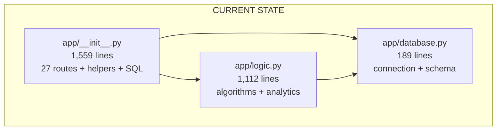
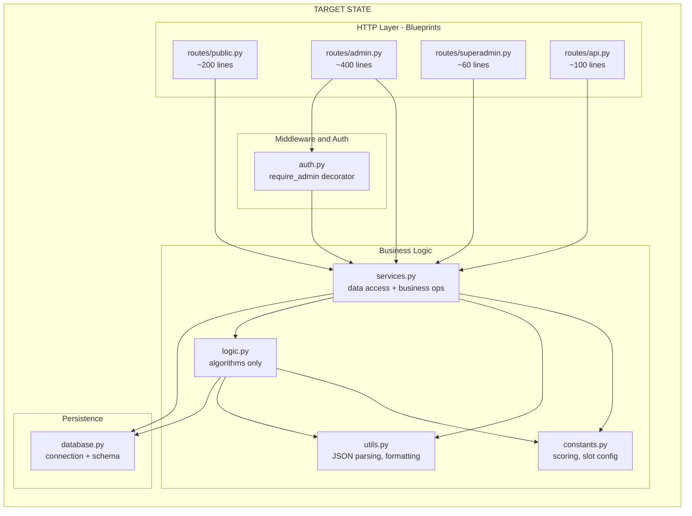

# Architectural Review & Refactoring Blueprint

**Audited:** 2026-09-08 | **Auditor:** Principal Architect (Automated) | **Codebase:** Kingdom Appointment Planner

---

## 1. Executive Summary & Architecture Scorecard

### System Health Overview

The Kingdom Appointment Planner is a functional, deployed Flask application that successfully solves its core scheduling problem. However, it suffers from a severe "God Module" anti-pattern — `app/__init__.py` is a 1,559-line monolith containing **27 route handlers**, inline SQL queries, business logic, authentication boilerplate, file I/O, and external API integration all in a single factory function. The `logic.py` module (1,112 lines) similarly concentrates multiple responsibilities including a 510-line `compute_event_insights` function. While the test suite (131 tests, all passing) is commendably behavior-focused with real database fixtures, the architectural structure makes the codebase fragile to change, difficult to onboard to, and risky for concurrent feature development.

### Top 3 High-Impact Wins

1. **Extract routes into Flask Blueprints with a Data Access Layer:** The single biggest improvement. Decompose `__init__.py` into `public`, `admin`, and `superadmin` Blueprints with a shared `services.py` module to eliminate the 13× repeated admin auth boilerplate and 50+ inline SQL calls.
2. **Extract admin authentication into a decorator:** The identical 10-line auth-check block is copy-pasted across 13 admin routes. A single `@require_admin` decorator eliminates ~130 lines of duplication and reduces the surface area for auth bypass bugs.
3. **Eliminate `generate_slot_labels` duplication and normalize scoring constants:** `generate_slot_labels` is defined identically in both `__init__.py` (L56-77) and `logic.py` (L578-599). Scoring multipliers (`30`, `2000`, `30000`, `90`, `1000`) are hardcoded magic numbers in `submit()` — extracting these as named constants prevents score-drift bugs.

### Scorecard (1-10)

| Dimension               | Score | Rationale |
|--------------------------|-------|-----------|
| **Modularity & Coupling** | 3/10 | Single 1,559-line god module; all routes defined as closures inside one factory function; no layer separation between HTTP handling, business logic, and persistence. |
| **Error Resilience**       | 5/10 | Key paths have validation and `hmac.compare_digest` auth, but several `except Exception: pass` blocks silently swallow errors. `unset_assignment` unpacks `submission_id` without try/except (crash on malformed input). |
| **Testing & Verification** | 7/10 | 131 tests, all passing, using real DB fixtures. Good coverage of happy paths and error cases. Gaps in CSRF validation testing, XSS escaping, and concurrency. Duplicate `test_format_minutes` across two files. |
| **Idiomatic Design**       | 4/10 | No Blueprints, no data access layer, no service layer. Raw `db.execute()` SQL scattered across 50+ locations in route handlers. No domain models or type-safe data contracts. |

---

## 2. Identified Architectural Issues

### CRITICAL Issues

#### ARCH-001: Hardcoded Default API Secret in Source Code
- **Severity:** CRITICAL
- **Location:** `config.py:18` — `EXTERNAL_API_SECRET = os.environ.get("EXTERNAL_API_SECRET", "mN4!pQs6JrYwV9")`
- **The Problem:** A non-trivial secret is hardcoded as a fallback default. This secret is committed to version control and is readable by anyone with repository access.
- **Why It Matters:** If the environment variable is not set in production (a common deployment oversight), the application runs with a known, public secret. This is a credential leak that could allow unauthorized API access.
- **Proposed Solution:** Remove the hardcoded fallback entirely. Require the environment variable and fail fast on startup if it's missing:
  ```python
  EXTERNAL_API_SECRET = os.environ.get("EXTERNAL_API_SECRET")
  # Validate at startup in create_app()
  if not app.config["EXTERNAL_API_SECRET"]:
      raise RuntimeError("EXTERNAL_API_SECRET environment variable is required")
  ```

#### ARCH-002: Unprotected Submission Overwrite (Unauthenticated Data Deletion)
- **Severity:** CRITICAL
- **Location:** `app/__init__.py:509-517` — `submit()` route
- **The Problem:** The `submit()` route deletes ALL existing submissions and assignments for a `player_id` + `event_uid` combination before inserting new ones. There is no authentication — any user who knows (or guesses) another player's numeric ID can overwrite their submission data.
- **Why It Matters:** This is a data integrity vulnerability. A malicious or careless user can wipe another player's carefully-entered scheduling data and resource allocations by submitting a form with someone else's `player_id`.
- **Proposed Solution:** Implement a submission token or session-bound verification:
  1. When a player first loads the form, generate a single-use HMAC token binding `event_uid + player_id` to the session.
  2. Verify this token on submission to ensure the submitter is the same session that loaded the form for that player.
  3. Alternatively, require admin confirmation for overwriting existing submissions.

#### ARCH-003: Crash in `unset_assignment` on Malformed Input
- **Severity:** CRITICAL
- **Location:** `app/__init__.py:1478` — `_, player_id, day_type = submission_id.split("_", 2)`
- **The Problem:** This unpacking has no try/except guard. If `submission_id` is None, empty, or doesn't contain exactly 2 underscores, this will crash with `ValueError` or `AttributeError`, returning a 500 error to the admin.
- **Why It Matters:** This is a production crash path triggered by malformed form data. The identical pattern in `manual_assign` (L867) *is* properly guarded — inconsistency indicating LLM-generated code drift.
- **Proposed Solution:** Add the same guard used in `manual_assign`:
  ```python
  try:
      _, player_id, day_type = submission_id.split("_", 2)
  except (ValueError, AttributeError):
      return "Invalid submission_id format", 400
  ```

#### ARCH-004: Admin Secrets Transmitted via GET Query Parameters
- **Severity:** CRITICAL
- **Location:** `app/__init__.py:853,938,1502` — `request.args.get("secret")` in `export_csv`, `export_submissions`, `view_logs`
- **The Problem:** Admin secrets are passed as URL query parameters for GET requests. These appear in browser history, server access logs, proxy logs, and can be leaked via the `Referer` header.
- **Why It Matters:** The admin secret is the sole authentication mechanism for event management. Its exposure grants full control over an event's data, including the ability to delete all submissions.
- **Proposed Solution:** Migrate admin auth to session-based authentication:
  1. Admin authenticates once via POST with the secret.
  2. Server sets a session cookie binding `admin_for_event_<uid> = True`.
  3. All subsequent requests check the session instead of requiring the secret in every URL.

---

### IMPORTANT Issues

#### ARCH-005: God Module Anti-Pattern in `app/__init__.py`
- **Severity:** IMPORTANT
- **Location:** `app/__init__.py` — entire file (1,559 lines)
- **The Problem:** All 27 route handlers are defined as nested closures inside `create_app()`. This single function spans from L140 to L1556 (1,416 lines). The file mixes HTTP request handling, direct SQL queries, business logic, file I/O, external API calls, and template rendering in a single undifferentiated blob.
- **Why It Matters:** (a) Any change to any route requires loading and parsing a 60KB file. (b) It's impossible to test route logic independently of HTTP/Flask. (c) Two developers cannot work on different routes without merge conflicts. (d) IDE navigation, code review, and comprehension are severely impaired.
- **Proposed Solution:** Decompose into Flask Blueprints:
  - `app/routes/public.py` — `index`, `guide`, `favicon`, `player_form`, `submit`, `submission_success`, `public_schedule`, `locked_appointments`, `success`
  - `app/routes/admin.py` — `admin_dashboard`, `manual_assign`, `distribute`, `export_csv`, `export_submissions`, `import_submissions`, `refresh_players`, `confirm`, `unlock`, `delete`, `update_alliance`, `override_resources`, `unset_assignment`, `view_logs`
  - `app/routes/superadmin.py` — `superadmin`, `superadmin_logout`
  - `app/routes/api.py` — `proxy_player`, `create_event`
  - `app/services.py` — shared business logic extracted from route handlers
  - `app/auth.py` — authentication decorators and helpers

#### ARCH-006: 13× Duplicated Admin Authentication Boilerplate
- **Severity:** IMPORTANT
- **Location:** `app/__init__.py` — every admin route (L835-913, L915-934, L936-985, L987-1039, L1041-1214, L1216-1254, L1256-1295, L1297-1336, L1338-1371, L1373-1399, L1401-1462, L1464-1498, L1500-1523)
- **The Problem:** Every admin route begins with this identical 6-line block:
  ```python
  secret = request.form.get("secret")  # or request.args.get("secret")
  db = database.get_db()
  db.row_factory = sqlite3.Row
  event = db.execute("SELECT * FROM events WHERE uid = ?", (event_uid,)).fetchone()
  if event is None:
      return "Event not found", 404
  if not secret or not hmac.compare_digest(event["admin_secret"], secret):
      return "Forbidden", 403
  ```
- **Why It Matters:** (a) DRY violation — 13 copies means 13 places to introduce auth bugs. (b) The `secret` source is inconsistent: some use `request.form`, others `request.args`. (c) If the auth logic needs to change (e.g., migrating to session auth), 13 locations must be updated in lockstep.
- **Proposed Solution:** Extract a `@require_admin` decorator:
  ```python
  # app/auth.py
  from functools import wraps


  def require_admin(f):
      @wraps(f)
      def decorated(event_uid, *args, **kwargs):
          secret = request.form.get("secret") or request.args.get("secret")
          db = database.get_db()
          db.row_factory = sqlite3.Row
          event = db.execute(
              "SELECT * FROM events WHERE uid = ?", (event_uid,)
          ).fetchone()
          if event is None:
              return "Event not found", 404
          if not secret or not hmac.compare_digest(event["admin_secret"], secret):
              return "Forbidden", 403
          # Inject event and db into the request context
          g.event = event
          g.admin_secret = secret
          return f(event_uid, *args, **kwargs)

      return decorated
  ```

#### ARCH-007: Duplicated `generate_slot_labels` Function
- **Severity:** IMPORTANT
- **Location:** `app/__init__.py:56-77` AND `app/logic.py:578-599`
- **The Problem:** `generate_slot_labels` is defined identically in two files with the same logic, same magic numbers, same zero-width-space character (`\u200b`). The `__init__.py` version is used in templates via the context processor, while `logic.py`'s version is used in `compute_event_insights`.
- **Why It Matters:** If the slot label format changes (e.g., different offset logic, different separator), one copy will be updated but not the other, leading to inconsistent labels between the admin dashboard and insight analytics.
- **Proposed Solution:** Delete the copy in `__init__.py`. Import from `logic.py` — it's already done partially (L33-40 imports other functions from logic). Add `generate_slot_labels` to the existing import list.

#### ARCH-008: Magic Number Scoring Multipliers in `submit()` Route
- **Severity:** IMPORTANT
- **Location:** `app/__init__.py:531-534,564,590`
- **The Problem:** Scoring formulas use unexplained magic numbers scattered across the `submit()` function:
  ```python
  score = (construction_speedups * 30) + (truegold * 2000) + (tempered_truegold * 30000)
  score = training_speedups * 90
  score = (research_speedups * 30) + (truegold_dust * 1000)
  ```
  These multipliers define the core business logic of resource valuation but are undocumented inline constants.
- **Why It Matters:** (a) A developer changing one multiplier might not know about or update the others. (b) The relationship between these numbers (e.g., why construction speedups = 30 but training = 90) is opaque. (c) Tests cannot verify scoring constants without knowing where they're defined.
- **Proposed Solution:** Extract to named constants in a `constants.py` module:
  ```python
  # app/constants.py
  SCORING_MULTIPLIERS = {
      "construction": {"speedups": 30, "truegold": 2000, "tempered_truegold": 30000},
      "training": {"speedups": 90},
      "research": {"speedups": 30, "truegold_dust": 1000},
  }
  DEFAULT_SLOT_COUNT = 49
  ```

#### ARCH-009: `compute_event_insights` is a 510-line Monolith
- **Severity:** IMPORTANT
- **Location:** `app/logic.py:602-1112`
- **The Problem:** A single function handles: database querying, in-memory joining, JSON parsing with error recovery, per-day and aggregate calculations for 6+ metrics (firepower, whale boards, alliance equity, timezone heatmaps, demand curves, rigid player analysis), CSS gradient string generation, and output dictionary assembly.
- **Why It Matters:** (a) Untestable — you cannot unit-test the heatmap calculation without setting up a full database with event/submission/assignment fixtures. (b) Debugging a single metric requires reading 500+ lines. (c) CSS generation in Python logic is a layer violation.
- **Proposed Solution:** Decompose into focused helpers:
  ```python
  def compute_event_insights(event_uid, db=None, max_rigid_slots=8):
      """Orchestrator — delegates to focused computation functions."""
      context = _load_event_context(event_uid, db)
      if context is None:
          return None
      
      return {
          "firepower": _compute_firepower(context),
          "whale_boards": _compute_whale_boards(context),
          "alliance_equity": _compute_alliance_equity(context),
          "heatmaps": _compute_heatmaps(context),
          "demand_analysis": _compute_demand_analysis(context),
          "rigid_players": _compute_rigid_players(context, max_rigid_slots),
          "by_day": _compute_per_day_breakdown(context, max_rigid_slots),
      }
  ```

#### ARCH-010: Triplicated Submission Insert Logic
- **Severity:** IMPORTANT
- **Location:** `app/__init__.py:522-608` — `submit()` route
- **The Problem:** The construction, training, and research submission processing blocks are structurally identical: extract form fields → compute score → build raw_data dict → generate submission_id → execute INSERT. The 3 blocks differ only in which form fields they read and which multipliers they use.
- **Why It Matters:** Adding a new day type (e.g., "healing") requires copying the block a 4th time. A bug fix to the INSERT statement must be applied in 3 places.
- **Proposed Solution:** Refactor to a loop over day-type configuration:
  ```python
  DAY_TYPE_CONFIG = {
      "construction": {
          "fields": ["speedups-construction", "truegold", "tempered_truegold"],
          "multipliers": {
              "speedups-construction": 30,
              "truegold": 2000,
              "tempered_truegold": 30000,
          },
      },
      # ... training, research
  }
  for day_type, config in DAY_TYPE_CONFIG.items():
      values = {f: int(request.form.get(f) or 0) for f in config["fields"]}
      score = sum(v * config["multipliers"][k] for k, v in values.items())
      if score > 0 and feasible_slots != "[]":
          _insert_submission(
              db, event_uid, day_type, player_data, score, values, feasible_slots
          )
  ```

#### ARCH-011: Silent Exception Swallowing in Context Processor
- **Severity:** IMPORTANT
- **Location:** `app/__init__.py:176-177` — `except (RuntimeError, Exception): pass`
- **The Problem:** The context processor catches *all* exceptions (via `Exception`) when querying the database for `slot_count`, silently discarding them. The `# noqa: BLE001, S110` comments acknowledge this is intentional suppression of linter warnings.
- **Why It Matters:** This hides real bugs: a malformed database, a connection timeout, or a schema mismatch will silently fall back to the default slot count of 49. The admin will see incorrect slot labels with no indication of failure.
- **Proposed Solution:** Log the exception and narrow the catch:
  ```python
  except sqlite3.Error as e:
      logging.getLogger("audit").warning(f"Failed to load slot_count for {event_uid}: {e}")
  ```

#### ARCH-012: No Data Access Layer — 50+ Raw SQL Calls in Route Handlers
- **Severity:** IMPORTANT
- **Location:** `app/__init__.py` — 50+ `db.execute(...)` calls across route handlers
- **The Problem:** Every route handler directly constructs SQL strings and manages `db.commit()` calls. There is no abstraction between the HTTP layer and the persistence layer.
- **Why It Matters:** (a) SQL query changes require modifying route handler code. (b) Identical queries (e.g., `SELECT * FROM events WHERE uid = ?`) are duplicated 15+ times. (c) Transaction boundaries are implicit and inconsistent — some routes commit, others rely on teardown. (d) Testing requires a real database because there's no seam to inject a mock.
- **Proposed Solution:** Create a `services.py` (or `repository.py`) module with typed functions:
  ```python
  # app/services.py
  def get_event_by_uid(db, event_uid) -> dict | None:
      """Fetch event by UID. Returns dict or None."""
      db.row_factory = sqlite3.Row
      row = db.execute("SELECT * FROM events WHERE uid = ?", (event_uid,)).fetchone()
      return dict(row) if row else None


  def get_submissions_for_event(db, event_uid, day_type=None) -> list[dict]: ...


  def create_submission(
      db, event_uid, day_type, player_data, score, raw_data, feasible_slots
  ) -> str: ...


  def delete_player_submissions(db, event_uid, player_id) -> None: ...
  ```

#### ARCH-013: `get_superadmin_metrics` is 300 Lines with In-Memory Joins
- **Severity:** IMPORTANT
- **Location:** `app/logic.py:274-575`
- **The Problem:** This function performs manual in-memory joining of submissions and assignments data, iterates over all events, and builds complex aggregated statistics. It uses `defaultdict`, `Counter`, and multiple nested loops to replicate what SQL aggregate queries could compute directly.
- **Why It Matters:** (a) Performance degrades linearly with total platform data — no pagination, no LIMIT. (b) The in-memory approach loads ALL submissions across ALL events into Python for filtering, rather than pushing the work to SQLite. (c) The "time_range" filtering is done via string interpolation in SQL (`f"AND e.created_at >= '{cutoff}'"` pattern in the original TODO), which is a SQL injection risk.
- **Proposed Solution:** Push aggregation to SQL, paginate results, and use parameterized queries for time filtering.

#### ARCH-014: JSON Parsing Repeated 7+ Times with Identical Error Recovery
- **Severity:** IMPORTANT
- **Location:** `app/logic.py` and `app/__init__.py` — multiple locations
- **The Problem:** The pattern `try: slots = json.loads(row["feasible_slots"]) except (json.JSONDecodeError, TypeError): slots = []` appears at least 7 times across the codebase. Similarly, `json.loads(row["raw_data"])` with fallback to `{}` appears 4+ times.
- **Why It Matters:** Violates DRY — a change to error recovery behavior (e.g., logging malformed data) must be replicated in 7+ places.
- **Proposed Solution:** Extract typed parsing helpers:
  ```python
  # app/utils.py
  def parse_json_list(raw: str | None, default: list | None = None) -> list:
      """Safely parse a JSON string expected to contain a list."""
      if not raw:
          return default or []
      try:
          result = json.loads(raw)
          return result if isinstance(result, list) else default or []
      except (json.JSONDecodeError, TypeError):
          return default or []


  def parse_json_dict(raw: str | None, default: dict | None = None) -> dict: ...
  ```

---

### MINOR Issues

#### ARCH-015: CSP Header Allows `unsafe-inline` for Scripts and Styles
- **Severity:** MINOR
- **Location:** `app/__init__.py:193-200`
- **The Problem:** The Content-Security-Policy allows `'unsafe-inline'` for both `script-src` and `style-src`, which significantly weakens XSS protection.
- **Why It Matters:** While this is common for Tailwind CSS CDN setups, it means injected script tags will execute. The current XSS mitigations rely entirely on Jinja2 auto-escaping, which has known bypass vectors for `|safe` filters and JavaScript contexts.
- **Proposed Solution:** Migrate inline styles to external CSS files and use nonce-based CSP for remaining inline scripts. For Tailwind, consider building static CSS at build time rather than using the CDN runtime compiler.

#### ARCH-016: `requirements.txt` Has Unpinned Dependencies
- **Severity:** MINOR
- **Location:** `requirements.txt`
- **The Problem:** All 6 dependencies are unpinned (`flask`, `gunicorn`, etc.). There is no `requirements.txt` with `==` pinned versions.
- **Why It Matters:** A `pip install` on different dates or machines may install different versions, leading to "works on my machine" bugs. The CI pipeline and production could run different library versions.
- **Proposed Solution:** Pin dependencies with exact versions:
  ```
  flask==3.1.1
  flask-wtf==1.2.2
  gunicorn==23.0.0
  python-dotenv==1.1.0
  requests==2.32.3
  markdown==3.7.1
  ```

#### ARCH-017: `print()` Statements Used for Debug Logging in Production Code
- **Severity:** MINOR
- **Location:** `app/database.py:118,125,139,151,155,157,164,168`
- **The Problem:** The database migration code uses `print("DEBUG: ...")` statements for logging migration progress instead of the application's audit logger.
- **Why It Matters:** These print statements go to stdout, which is captured differently by Gunicorn workers versus direct Python execution. They cannot be filtered, rotated, or disabled independently.
- **Proposed Solution:** Replace with `logging.getLogger(__name__).info(...)` calls.

#### ARCH-018: Inconsistent Type Annotations
- **Severity:** MINOR
- **Location:** `app/logic.py` — mixed annotation coverage
- **The Problem:** Some functions have full type annotations (`generate_short_uid(length: int = 8) -> str`), others have none (`run_distribution_algorithm(event_uid, day_type=None)`). No function in `__init__.py` has return type annotations.
- **Why It Matters:** Inconsistent annotations prevent effective use of `mypy` or `pyright` for static analysis. New contributors can't determine expected types without reading implementation.
- **Proposed Solution:** Add type annotations to all public functions, especially in `logic.py` and `services.py`. Consider adding a `py.typed` marker and running `mypy` in CI.

#### ARCH-019: Duplicate `test_format_minutes` Test
- **Severity:** MINOR
- **Location:** `tests/test_logic.py` AND `tests/test_speedup_enhancements.py`
- **The Problem:** `test_format_minutes` is defined in both files with identical assertions.
- **Why It Matters:** Maintenance burden — changes to `format_minutes` behavior require updating two test files. It also inflates test counts, giving a false sense of coverage breadth.
- **Proposed Solution:** Delete the duplicate from `test_speedup_enhancements.py` and keep the canonical version in `test_logic.py`.

#### ARCH-020: Admin Dashboard Template is 1,452 Lines
- **Severity:** MINOR
- **Location:** `app/templates/admin_dashboard.html` — 1,452 lines
- **The Problem:** The admin dashboard template is a single, massive file containing HTML structure, Tailwind CSS classes, embedded JavaScript (with Sortable.js, drag-and-drop, tab switching, filtering), and Jinja2 logic.
- **Why It Matters:** Template modifications require navigating a 1,452-line file. JavaScript and CSS are not in separate files, preventing caching, linting, and independent testing.
- **Proposed Solution:** Extract JavaScript into `app/static/js/admin_dashboard.js`. Consider using Jinja2 `` to break the template into component partials (e.g., `_submission_table.html`, `_slot_grid.html`, `_insights_panel.html`).

---

## 3. Target State Architecture & Contracts

### Current vs. Target Architecture

**Current State:**


**Target State:**


### Target File Structure

```
app/
├── __init__.py          # ~50 lines: create_app(), register blueprints, middleware
├── auth.py              # ~40 lines: @require_admin, @require_superadmin decorators
├── constants.py         # ~30 lines: SCORING_MULTIPLIERS, DEFAULT_SLOT_COUNT, RESERVED_SLUGS
├── database.py          # ~190 lines: connection management, schema (unchanged)
├── logic.py             # ~600 lines: scheduling algorithm, insights (decomposed)
├── services.py          # ~250 lines: data access functions, submission CRUD
├── utils.py             # ~60 lines: parse_json_list, parse_json_dict, validate_safe_url, format_minutes
├── routes/
│   ├── __init__.py      # empty
│   ├── public.py        # ~200 lines: index, guide, player_form, submit, public_schedule, etc.
│   ├── admin.py         # ~400 lines: dashboard, manual_assign, import/export, etc.
│   ├── superadmin.py    # ~60 lines: superadmin dashboard, logout
│   └── api.py           # ~100 lines: proxy_player, create_event
├── templates/           # (unchanged, but add include partials later)
└── static/              # (unchanged)
```

### Key Interface Contracts

```python
# app/auth.py — Authentication Decorator Contract
from functools import wraps
from flask import g, request
import hmac
import sqlite3
from . import database


def require_admin(f):
    """Decorator that authenticates admin access for an event.

    Expects: route parameter `event_uid`.
    Sets: g.event (sqlite3.Row), g.admin_secret (str), g.db (sqlite3.Connection).
    Returns: 403/404 on auth failure.
    """

    @wraps(f)
    def decorated(event_uid, *args, **kwargs):
        secret = request.form.get("secret") or request.args.get("secret")
        db = database.get_db()
        db.row_factory = sqlite3.Row
        event = db.execute(
            "SELECT * FROM events WHERE uid = ?", (event_uid,)
        ).fetchone()
        if event is None:
            return "Event not found", 404
        if not secret or not hmac.compare_digest(event["admin_secret"], secret):
            return "Forbidden", 403
        g.event = event
        g.admin_secret = secret
        g.db = db
        return f(event_uid, *args, **kwargs)

    return decorated
```

```python
# app/services.py — Data Access Contract (Key Functions)


def get_event_by_uid(db: sqlite3.Connection, event_uid: str) -> dict | None:
    """Fetch a single event by its UID. Returns dict or None."""
    ...


def get_submissions_for_event(
    db: sqlite3.Connection, event_uid: str, day_type: str | None = None
) -> list[dict]:
    """Fetch all submissions for an event, optionally filtered by day_type.
    Returns list of dicts with parsed feasible_slots and raw_data."""
    ...


def get_assignments_for_event(
    db: sqlite3.Connection, event_uid: str, day_type: str | None = None
) -> list[dict]:
    """Fetch all assignments for an event, optionally filtered by day_type."""
    ...


def create_submission(
    db: sqlite3.Connection,
    event_uid: str,
    day_type: str,
    player_id: str,
    player_name: str,
    alliance_name: str,
    score: float,
    raw_data: dict,
    feasible_slots: list[int],
    avatar_url: str | None = None,
    backpack_url: str | None = None,
) -> str:
    """Insert a new submission. Returns submission_id."""
    ...


def delete_player_data(db: sqlite3.Connection, event_uid: str, player_id: str) -> None:
    """Delete all submissions and assignments for a player in an event."""
    ...


def compute_score(day_type: str, raw_data: dict) -> float:
    """Compute the resource score for a submission using SCORING_MULTIPLIERS."""
    ...
```

```python
# app/utils.py — Utility Contract


def parse_json_list(raw: str | None, default: list | None = None) -> list:
    """Safely parse a JSON string expected to be a list. Returns default on failure."""
    ...


def parse_json_dict(raw: str | None, default: dict | None = None) -> dict:
    """Safely parse a JSON string expected to be a dict. Returns default on failure."""
    ...


def validate_safe_url(url: str | None) -> str | None:
    """Validate URL uses only safe HTTP(S) or /static/ schemes. Returns cleaned URL or None."""
    ...
```

```python
# app/constants.py — Configuration Constants

DEFAULT_SLOT_COUNT: int = 49

SCORING_MULTIPLIERS: dict[str, dict[str, int]] = {
    "construction": {"speedups": 30, "truegold": 2000, "tempered_truegold": 30000},
    "training": {"speedups": 90},
    "research": {"speedups": 30, "truegold_dust": 1000},
}

RESERVED_SLUGS: set[str] = {
    "admin",
    "create",
    "distribute",
    "event",
    "export_csv",
    "guide",
    "static",
    "success",
    "confirm",
    "unlock",
    "delete",
    "manual_assign",
    "unset",
    "override_resources",
    "update_alliance",
    "submission-success",
    "favicon.ico",
    "superadmin",
}
```

---

## 4. Gemini Implementation Action Plan (Step-by-Step)

> **Execution Strategy:** Each phase is self-contained and leaves the test suite green. No phase should be started until the prior phase's verification passes.

### Phase 1: Foundation — Extract Constants, Utilities, and Auth

#### Task 1.1: Create `app/constants.py`
- **Files to Create:** `app/constants.py`
- **Files to Modify:** `app/__init__.py`, `app/logic.py`
- **Objective:** Extract all magic numbers and shared constants into a single module.
- **Implementation Specification:**
  1. Create `app/constants.py` with `DEFAULT_SLOT_COUNT`, `SCORING_MULTIPLIERS`, and `RESERVED_SLUGS` (move from `logic.py:11-30`).
  2. In `app/logic.py`, replace the `RESERVED_SLUGS` set definition with `from .constants import RESERVED_SLUGS`. Replace all hardcoded `49` slot count defaults with `from .constants import DEFAULT_SLOT_COUNT`.
  3. In `app/__init__.py`, replace the scoring math in `submit()` (L522-608) to use `SCORING_MULTIPLIERS` from constants.
- **Acceptance Criteria:**
  - `constants.py` exists with all three constants.
  - No hardcoded `49` remains as a slot count default in `logic.py` or `__init__.py` (except in `database.py` schema default which is SQL).
  - `RESERVED_SLUGS` is defined in exactly one place.
  - All 131 tests pass.

#### Task 1.2: Create `app/utils.py`
- **Files to Create:** `app/utils.py`
- **Files to Modify:** `app/__init__.py`, `app/logic.py`
- **Objective:** Extract shared utility functions to eliminate duplication.
- **Implementation Specification:**
  1. Create `app/utils.py` with:
     - `parse_json_list(raw, default=None) -> list` — extracted from the 7+ duplicated JSON parsing patterns.
     - `parse_json_dict(raw, default=None) -> dict` — same pattern for dicts.
     - `validate_safe_url(url) -> str | None` — moved from `__init__.py:46-53`.
     - `format_minutes(total_minutes) -> str` — moved from `logic.py:218-232`.
  2. Delete `generate_slot_labels` from `app/__init__.py` (L56-77). It already exists in `logic.py:578-599`. Add it to the import list at `__init__.py:33-40`.
  3. Replace all `json.loads(row["feasible_slots"])` with `try/except` patterns in both files with calls to `parse_json_list()`.
  4. Replace all `json.loads(row["raw_data"])` with `try/except` patterns with calls to `parse_json_dict()`.
  5. Update imports in `__init__.py` and `logic.py` to use `from .utils import ...`.
- **Acceptance Criteria:**
  - `generate_slot_labels` is defined in exactly one place (`logic.py`).
  - `validate_safe_url` is defined in exactly one place (`utils.py`).
  - `format_minutes` is defined in exactly one place (`utils.py`).
  - No inline `try: json.loads(...) except` patterns remain for feasible_slots or raw_data parsing.
  - All 131 tests pass.

#### Task 1.3: Create `app/auth.py`
- **Files to Create:** `app/auth.py`
- **Files to Modify:** `app/__init__.py`
- **Objective:** Extract the admin authentication pattern into a reusable decorator.
- **Implementation Specification:**
  1. Create `app/auth.py` with:
     - `require_admin(f)` decorator as specified in Section 3 contracts.
     - `require_superadmin(f)` decorator that checks `session.get("is_superadmin")`.
  2. In `app/__init__.py`, for ALL 13 admin routes, replace the boilerplate auth block with `@require_admin` and access the event via `g.event`, the secret via `g.admin_secret`, and the db via `g.db` or `database.get_db()`.
  3. For the `superadmin()` route, apply `@require_superadmin` for the dashboard rendering path (keep the secret-based initial auth as a separate login endpoint).
- **Acceptance Criteria:**
  - No admin route contains inline auth boilerplate (the 6-line block is gone from all 13 routes).
  - `g.event`, `g.admin_secret` are available in all admin route handlers.
  - All 131 tests pass (including all auth-related tests in `test_routes.py` and `test_security.py`).

#### Task 1.4: Fix ARCH-003 Crash Bug
- **Files to Modify:** `app/__init__.py`
- **Objective:** Add missing error handling for `submission_id.split()` in `unset_assignment`.
- **Implementation Specification:**
  1. At L1478, wrap the `split` in a try/except matching the pattern used in `manual_assign` (L866-869).
  2. Add a guard for `submission_id` being `None` or empty string.
- **Acceptance Criteria:**
  - Sending a POST to `/admin/<uid>/unset` with a malformed `submission_id` returns 400, not 500.
  - Add a test in `test_routes.py` verifying this behavior.
  - All tests pass.

**Phase 1 Verification:**
```bash
./venv/bin/pytest -v
./venv/bin/ruff check .
./venv/bin/ruff format --check .
```

---

### Phase 2: Blueprint Decomposition

#### Task 2.1: Create Route Blueprint Structure
- **Files to Create:** `app/routes/__init__.py`, `app/routes/public.py`, `app/routes/admin.py`, `app/routes/superadmin.py`, `app/routes/api.py`
- **Files to Modify:** `app/__init__.py`
- **Objective:** Decompose the monolithic `create_app()` into focused Blueprint modules.
- **Implementation Specification:**
  1. Create `app/routes/__init__.py` (empty or with a `register_blueprints(app)` helper).
  2. Create `app/routes/public.py`:
     - Define `bp = Blueprint("public", __name__)`.
     - Move routes: `index`, `guide`, `favicon`, `player_form`, `submit`, `submission_success`, `public_schedule`, `locked_appointments`, `success`.
     - Each route function becomes a module-level function (no longer a closure).
     - Use `current_app.audit_logger` instead of `app.audit_logger`.
     - Import `database`, `logic`, `utils`, `constants`, `auth` as needed.
  3. Create `app/routes/admin.py`:
     - Define `bp = Blueprint("admin", __name__, url_prefix="/admin")`.
     - Move all 14 admin routes.
     - Apply `@require_admin` decorator to each.
     - Adjust URL patterns: remove `/admin/` prefix from route strings since it's in the blueprint prefix.
     - **Important:** The `url_prefix="/admin"` means route decorators should be `@bp.route("/<event_uid>/distribute")` not `@bp.route("/admin/<event_uid>/distribute")`.
  4. Create `app/routes/superadmin.py`:
     - Define `bp = Blueprint("superadmin", __name__)`.
     - Move `superadmin` and `superadmin_logout`.
  5. Create `app/routes/api.py`:
     - Define `bp = Blueprint("api", __name__)`.
     - Move `proxy_player` and `create_event`.
     - Move the `fetch_player_info` helper function here (it's only used by `proxy_player`).
  6. Refactor `app/__init__.py`:
     - `create_app()` should only: create app, load config, init CSRF, init database, setup logging, register context processor, register after_request, register blueprints, return app.
     - Target: `__init__.py` should be 100 lines or fewer.
  7. **CRITICAL:** Update all `url_for()` calls throughout the codebase to include blueprint names:
     - `url_for("admin_dashboard", ...)` becomes `url_for("admin.admin_dashboard", ...)`
     - `url_for("index")` becomes `url_for("public.index")`
     - `url_for("submission_success")` becomes `url_for("public.submission_success")`
     - `url_for("superadmin")` becomes `url_for("superadmin.superadmin")`
     - `url_for("proxy_player")` becomes `url_for("api.proxy_player")`
     - etc.
  8. Update `url_for()` calls in all Jinja2 templates (`app/templates/*.html`) as well.
- **Acceptance Criteria:**
  - `app/__init__.py` is 100 lines or fewer.
  - All routes work at the same URL paths as before (no URL changes).
  - All 131 tests pass.
  - No imports of route functions from `__init__.py`.

#### Task 2.2: Create `app/services.py` Data Access Layer
- **Files to Create:** `app/services.py`
- **Files to Modify:** `app/routes/public.py`, `app/routes/admin.py`, `app/routes/api.py`
- **Objective:** Extract repeated SQL queries into a typed data access module.
- **Implementation Specification:**
  1. Create `app/services.py` with the functions specified in Section 3 contracts.
  2. Implement at minimum:
     - `get_event_by_uid(db, event_uid)` — used 15+ times.
     - `get_submissions_for_event(db, event_uid, day_type=None)` — used 5+ times.
     - `get_assignments_for_event(db, event_uid, day_type=None)` — used 4+ times.
     - `create_submission(db, ...)` — used 3 times (the triplicated insert).
     - `delete_player_data(db, event_uid, player_id)` — used in submit and import.
     - `compute_score(day_type, raw_data)` — centralizes scoring math using `SCORING_MULTIPLIERS`.
  3. Replace inline SQL calls in route files with service function calls.
  4. The `submit()` route's triplicated insert block should become a loop using `compute_score()` and `create_submission()`.
- **Acceptance Criteria:**
  - No route file contains raw `db.execute("SELECT * FROM events ...")` queries for event lookups or submission CRUD.
  - `compute_score()` is the single source of truth for scoring.
  - All 131 tests pass.

**Phase 2 Verification:**
```bash
./venv/bin/pytest -v
./venv/bin/ruff check .
./venv/bin/ruff format --check .
# Verify no direct SQL in route files (except for highly specific one-off queries):
grep -rn "db.execute" app/routes/ | wc -l
# Should be minimal (< 10 remaining one-off queries)
```

---

### Phase 3: Logic Module Decomposition & Test Hardening

#### Task 3.1: Decompose `compute_event_insights`
- **Files to Modify:** `app/logic.py`
- **Objective:** Break the 510-line monolith into focused helper functions.
- **Implementation Specification:**
  1. Create a private `_EventContext` dataclass to hold the shared state passed between helpers:
     ```python
     from dataclasses import dataclass, field


     @dataclass
     class _EventContext:
         event_uid: str
         slot_count: int
         active_days: list[str]
         slot_labels: list[str]
         submissions: list[dict]
         assignments: list[dict]
         assigned_pairs: set[tuple[str, str]]
     ```
  2. Extract into helper functions (all prefixed with `_` to indicate private):
     - `_load_event_context(event_uid, db) -> _EventContext | None`
     - `_compute_firepower(ctx) -> dict`
     - `_compute_whale_boards(ctx, day_type=None) -> list[dict]`
     - `_compute_alliance_equity(ctx, day_type=None) -> dict`
     - `_compute_heatmaps(ctx, day_type=None) -> dict`
     - `_compute_rigid_players(ctx, max_rigid_slots, day_type=None) -> list[dict]`
  3. `compute_event_insights()` becomes an orchestrator calling these helpers.
  4. Move CSS gradient generation out of Python — return raw numeric values and generate gradients in the Jinja2 template or JavaScript.
- **Acceptance Criteria:**
  - `compute_event_insights` is 50 lines or fewer (just orchestration).
  - Each helper function is 80 lines or fewer.
  - All tests in `test_logic.py` pass.

#### Task 3.2: Replace `print()` with Structured Logging in `database.py`
- **Files to Modify:** `app/database.py`
- **Objective:** Replace debug print statements with proper logging.
- **Implementation Specification:**
  1. Add `import logging` at the top of `database.py`.
  2. Create a module-level logger: `logger = logging.getLogger(__name__)`.
  3. Replace all `print("DEBUG: ...")` calls with `logger.info(...)` or `logger.warning(...)`.
- **Acceptance Criteria:**
  - No `print()` calls remain in `database.py`.
  - Migration logs appear in the application's standard logging output.
  - All tests pass.

#### Task 3.3: Add Missing Tests for Critical Paths
- **Files to Modify:** `tests/test_routes.py`, `tests/test_security.py`, `tests/test_logic.py`, `tests/test_speedup_enhancements.py`
- **Objective:** Close the coverage gaps identified in the audit.
- **Implementation Specification:**
  1. **`test_routes.py`:** Add test for `unset_assignment` with malformed `submission_id` (verifies ARCH-003 fix).
  2. **`test_routes.py`:** Add test for `submit()` with `int()` conversion failure (e.g., `speedups-construction` = "abc") — currently an uncaught ValueError.
  3. **`test_security.py`:** Add test verifying that `<script>` tags in `player_name` are escaped in rendered templates (anti-XSS).
  4. **`test_speedup_enhancements.py`:** Remove the duplicate `test_format_minutes` from this file and keep the canonical version in `test_logic.py`.
  5. **`test_routes.py`:** Where possible, refactor tests to use the `test_event` fixture from `conftest.py` instead of the repeated 10-line inline setup boilerplate. Be careful not to change test semantics when refactoring.
- **Acceptance Criteria:**
  - At least 3 new tests added.
  - Duplicate `test_format_minutes` removed from `test_speedup_enhancements.py`.
  - All tests pass.
  - No test regression.

**Phase 3 Verification:**
```bash
./venv/bin/pytest -v --tb=short
./venv/bin/ruff check .
./venv/bin/ruff format --check .
```

---

### Phase 4: Security Hardening & Polish

#### Task 4.1: Remove Hardcoded Secret Default
- **Files to Modify:** `config.py`
- **Objective:** Fix ARCH-001 — remove the hardcoded `EXTERNAL_API_SECRET` fallback.
- **Implementation Specification:**
  1. Change `EXTERNAL_API_SECRET` to `os.environ.get("EXTERNAL_API_SECRET")` (no default).
  2. Also change `SECRET_KEY` default from `"dev-key-for-internal-use-only-123"` to require an env var in non-testing contexts.
  3. In `create_app()`, add a startup check:
     ```python
     if not app.testing and app.config["SECRET_KEY"] == "dev-key-for-internal-use-only-123":
         import warnings

         warnings.warn(
             "SECRET_KEY is using the insecure default. Set SECRET_KEY environment variable.",
             stacklevel=2,
         )
     ```
  4. Update `.env.example` to include `EXTERNAL_API_SECRET=generate-a-secret-here`.
- **Acceptance Criteria:**
  - `EXTERNAL_API_SECRET` has no hardcoded default in `config.py`.
  - Production deployments without `SECRET_KEY` set will see a warning.
  - `.env.example` documents all required variables.
  - All tests pass (test fixtures set required env vars).

#### Task 4.2: Pin Dependencies
- **Files to Modify:** `requirements.txt`
- **Objective:** Fix ARCH-016 — pin all dependency versions.
- **Implementation Specification:**
  1. Run `pip freeze` in the venv to get current installed versions.
  2. Update `requirements.txt` with pinned versions for the 6 direct dependencies only.
  3. Add a comment header explaining the pinning strategy.
- **Acceptance Criteria:**
  - All 6 dependencies have `==` pinned versions.
  - `pip install -r requirements.txt` in a fresh venv succeeds.
  - All tests pass.

#### Task 4.3: Add Type Annotations to Core Functions
- **Files to Modify:** `app/logic.py`, `app/services.py`, `app/utils.py`, `app/auth.py`
- **Objective:** Fix ARCH-018 — ensure all public functions have complete type annotations.
- **Implementation Specification:**
  1. Add return type annotations to `run_distribution_algorithm`, `get_ordered_active_days`.
  2. Add parameter and return type annotations to all functions in `services.py`, `utils.py`, and `auth.py`.
  3. Ensure `logic.py` helper functions (`_compute_firepower`, etc.) have type annotations.
- **Acceptance Criteria:**
  - Every public function has complete parameter and return type annotations.
  - `./venv/bin/ruff check .` passes.
  - All tests pass.

**Phase 4 Verification:**
```bash
./venv/bin/pytest -v --tb=short
./venv/bin/ruff check .
./venv/bin/ruff format --check .
```

---

## 5. Implementation Guardrails for Gemini

1. **Zero Test Regression:** Every phase must end with all 131+ existing tests passing. Do not delete or modify existing test assertions unless explicitly instructed (e.g., removing the duplicate `test_format_minutes`). Run `./venv/bin/pytest -v` after every file change.

2. **Preserve URL Structure:** All refactoring MUST maintain identical URL paths. Users have bookmarked admin URLs with secrets. Blueprint URL prefixes must match existing paths exactly. Verify by running the full `test_routes.py` suite.

3. **No New Dependencies:** Do not add any packages to `requirements.txt` unless explicitly specified in a task. The refactoring is structural only — no framework swaps, no ORM introduction, no new libraries.

4. **Backward-Compatible Imports:** If any module's public API changes (e.g., moving `validate_safe_url` from `__init__.py` to `utils.py`), ensure the old import path still works via re-export, or update ALL consumers. Grep for the old import path across the entire codebase including tests.

5. **Maintain CSRF Protection:** `CSRFProtect` is initialized in `create_app()`. When moving routes to Blueprints, ensure CSRF exemptions (if any) are preserved and the CSRF token is still available in all templates. Do not add `@csrf.exempt` unless the route is a public API endpoint.

6. **Database Schema Unchanged:** Do not modify `database.py` schema definitions, migration logic, or table structures. The persistence layer is stable — this refactoring targets only the application layer above it.

7. **Ruff Compliance:** All code must pass `./venv/bin/ruff check .` and `./venv/bin/ruff format --check .` after every task. Do not add `# noqa` suppression comments unless absolutely necessary and documented with rationale.
